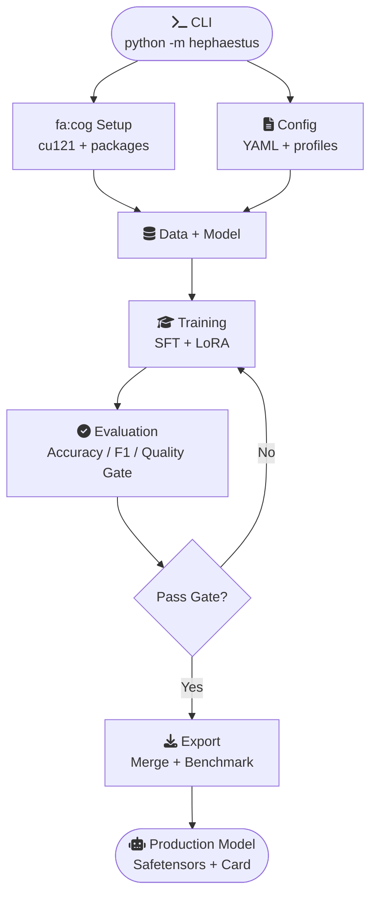
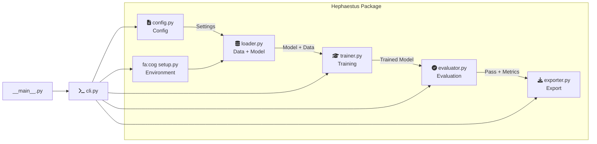
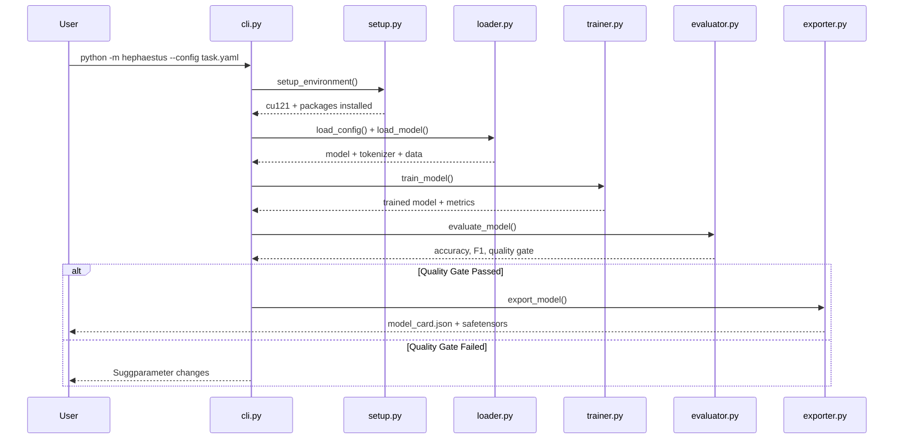

# Hephaestus Architecture

## System Overview

Hephaestus is an automated LLM forge that takes any base model + domain task and produces a production-ready specialized model through QLoRA fine-tuning.



---

## Module Design



---

## Execution Flow



---

## Directory Structure

```
hephaestus/
├── hephaestus/              │   ├── __init__.py           # Package init
│   ├── __main__.py           # Entry: python -m hephaestus
│   ├── cli.py                # CLI interface + orchestration
│   ├── config.py             # Configuration system (YAML + profiles)
│   ├── setup.py              # Environment setup (cu121 + packages)
│   ├── loader.py             # Model + data loading
│   ├── trainer.py            # SFT training engine
│   ├── evaluator.py          # Evaluation + quality gates
│   └── exporter.py           # Model export + benchmarking
├── configs/                  # Configuration profiles
│   ├── hdfs-accuracy.yaml    # 3B model, best accuracy
│   ├── hdfs-balanced.yaml    # 1.5B model, speed/quality
│   └── hdfs-latency.yaml     # 0.5B model, fastest
├── data/hdfs/                # HDFS dataset
│   ├── hdfs_train_conversations.jsonl
│   └── hdfs_test_conversations.jsonl
├── pyproject.toml            # Package dependencies
├── .gitignore
└── README.md
```

---

## Module Responsibilities

### `setup.py` — Environment Setup

| Responsibility | Detail |
|----------------|--------|
| Install cu121 stack | Overrides Kaggle's default cu128 (incompatible with P100) |
| Install ML packages | transformers, peft, trl, accelerate, datasets, bitsandbytes |
| Set env vars | HF_HUB_ENABLE_HF_TRANSFER, PYTORCH_CUDA_ALLOC_CONF |
| Verify GPU | Detect CUDA device, check compatibility |

**Why cu121?** Kaggle's default PyTorch ships with CUDA 12.8 binaries that don't include sm_60 (P100). Installing cu121 ensures P100 compatibility for BasicAuth read operations.

### `config.py` — Configuration System

| Feature | Description |
|---------|-------------|
| YAML loading | Load config from `.yaml` with validation |
| CLI overrides | Override any field via command line |
| Usage profiles | `latency` / `balanced` / `accuracy` presets |
| Nested dataclasses | Type-safe configuration for each module |

**Usage profiles:**

| Profile | Model | Rank | Batch | Max Length | Target |
|---------|-------|------|-------|------------|--------|
| latency | 0.5B | 64 | 2 | 512 | <50ms inference |
| balanced | 1.5B | 128 | 2 | 1024 | <200ms inference |
| accuracy | 3B | 256 | 1 | 2048 | Maximum accuracy |

### `loader.py` — Data + Model Loading

| Function | Input | Output |
|----------|-------|--------|
| `load_dataset(config)` | YAML config | Formatted training data |
| `load_test_dataset(config)` | YAML config | Formatted test data |
| `load_model(config)` | YAML config | Model + tokenizer |

**Dataset format:**
```json
{"messages": [
  {"role": "system", "content": "You are a SOC analyst..."},
  {"role": "user", "content": "Classify this log entry..."},
  {"role": "assistant", "content": "ANOMALY. Reason: ..."}
]}
```

**Model loading:**
1. Load base model in fp16 with `device_map="auto"`
2. Apply LoRA with configurable rank/alpha/target modules
3. Assert model is on CUDA
4. Print trainable parameter count

### `trainer.py` — SFT Training Engine

| Optimization | Purpose |
|--------------|---------|
| 8-bit Adam (bitsandbytes) | 4x optimizer memory savings vs fp32 Adam |
| Gradient checkpointing | Compute activations on-demand (2x memory savings) |
| Cosine LR schedule | Smooth convergence without manual tuning |
| Warmup steps | Stabilize early training |

**Training configuration:**

```yaml
training:
  max_steps: 200        # Sweet spot: 50-200 (1000+ overfits)
  learning_rate: 2e-5   # Lower for larger models
  batch_size: 1         # For 3B on 16GB VRAM
  gradient_accumulation_steps: 2
  bf16: true            # 2 bytes/param, minimal accuracy loss
  optimizer: adamw_bnb_8bit
  gradient_checkpointing: true
```

### `evaluator.py` — Evaluation + Quality Gates

| Metric | Formula | Purpose |
|--------|---------|---------|
| Accuracy | (TP+TN) / Total | Overall correctness |
| Precision | TP / (TP+FP) | Minimize false alarms |
| Recall | TP / (TP+FN) | Minimize missed threats |
| F1 | 2*P*R / (P+R) | Balanced metric |

**Quality gate:** If accuracy < threshold, the pipeline reports failure with suggestions for improvement.

### `exporter.py` — Model Export + Benchmarking

| Step | Description |
|------|-------------|
| Merge LoRA | Combine adapter weights into base model |
| Save safetensors | Production-ready format |
| Benchmark | Measure TPS, latency, model size |
| Model card | JSON with all metrics + config for reproducibility |

**Output structure:**
```
outputs/task/
├── model/
│   ├── config.json
│   ├── model.safetensors
│   └── tokenizer.json
└── model_card.json
```

---

## CLI Usage

```bash
# Run with config file
python -m hephaestus --config configs/hdfs-accuracy.yaml

# Run with usage profile
python -m hephaestus --profile accuracy

# Override specific parameters
python -m hephaestus --config configs/hdfs-balanced.yaml --training.max_steps 300
```

---

## Design Decisions

| Decision | Rationale |
|----------|-----------|
| PyTorch + TRL (not Unsloth) | No vendor lock-in, full transparency, debuggable |
| cu121 for P100 | Kaggle ships cu128 which breaks sm_60 GPUs |
| QLoRA over full fine-tuning | 10x less memory, 12.5% trainable params |
| 8-bit Adam | 4x optimizer memory vs fp32 |
| safetensors format | Safe, fast, standard for model sharing |
| YAML config | Human-readable, version-controllable, reproducible |

---

## Results (v0.1)

| Model | Accuracy | F1 | Train Time | Size |
|-------|----------|-----|------------|------|
| Qwen2.5-0.5B | 91.0% | 90.2% | 7.6 min | 988 MB |
| Qwen2.5-3B | 96.0% | 95.1% | 17.3 min | ~6 GB |

---

*Last updated: 2026-06-30*
